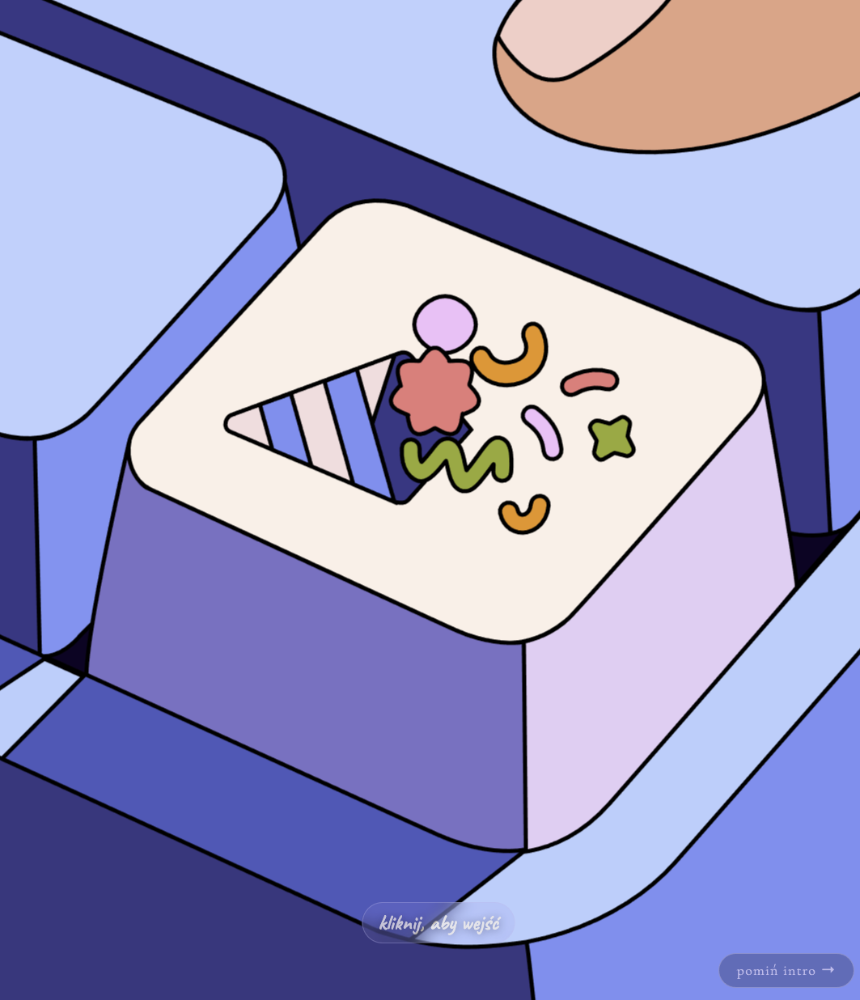
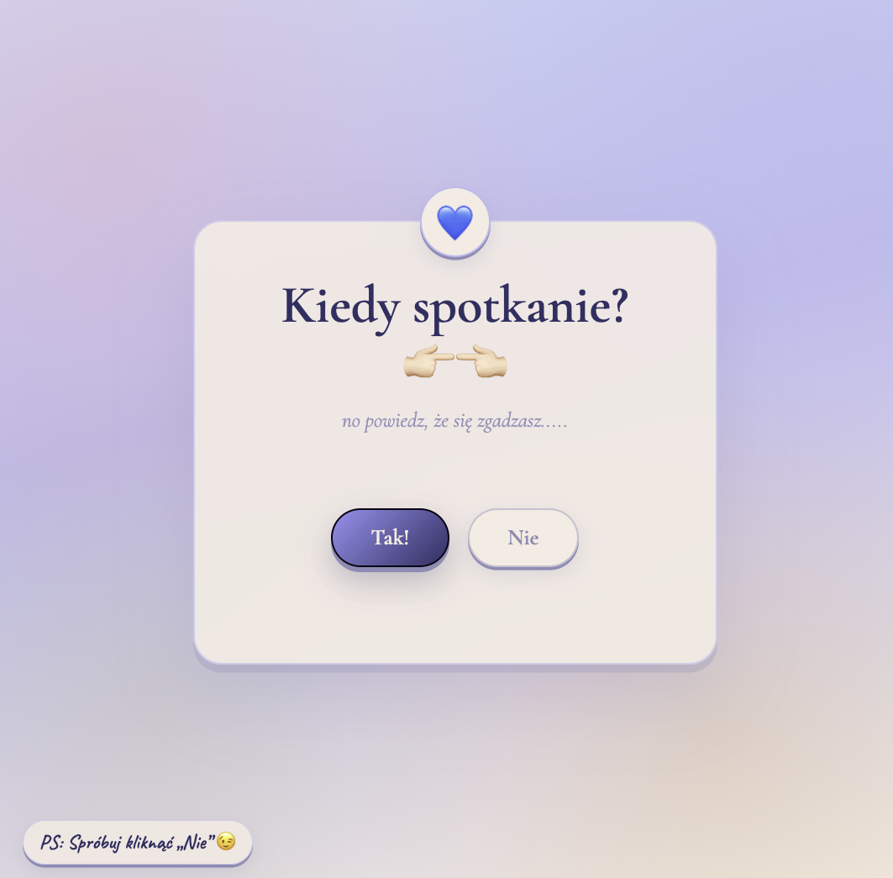
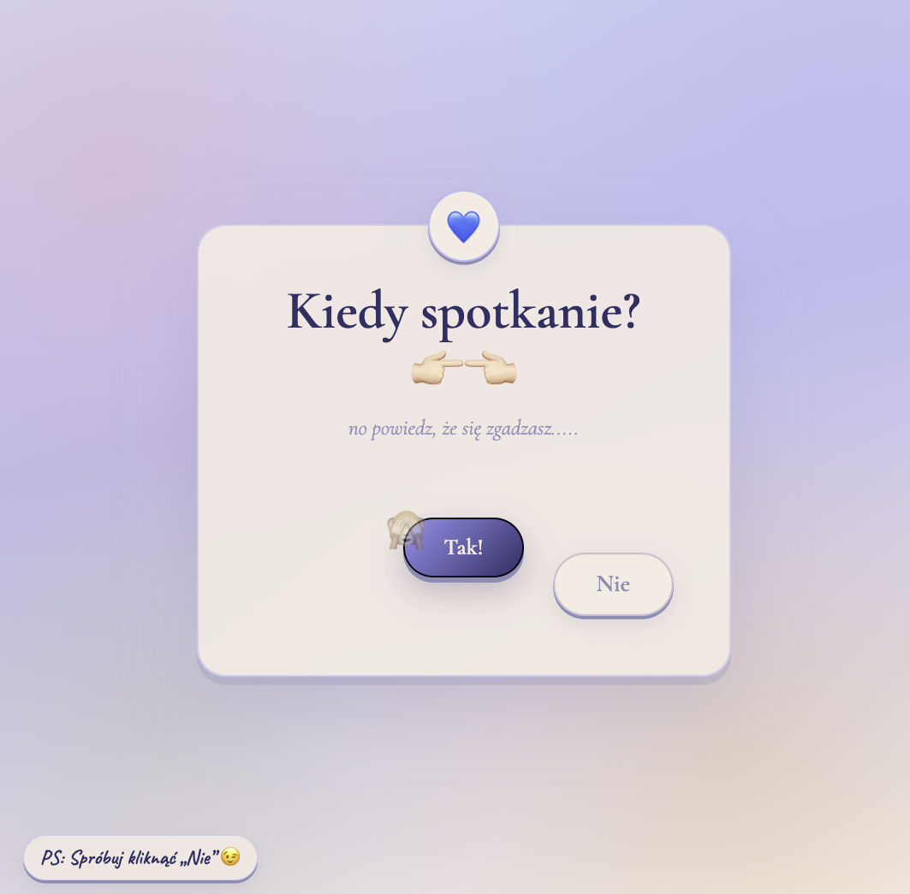
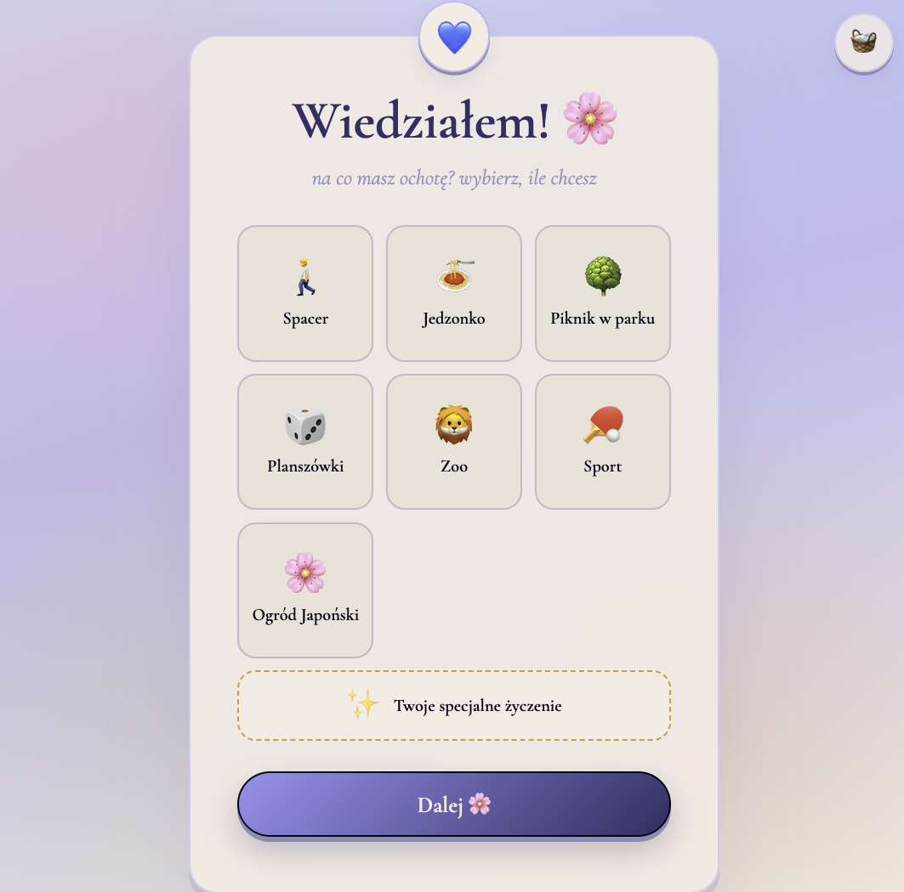
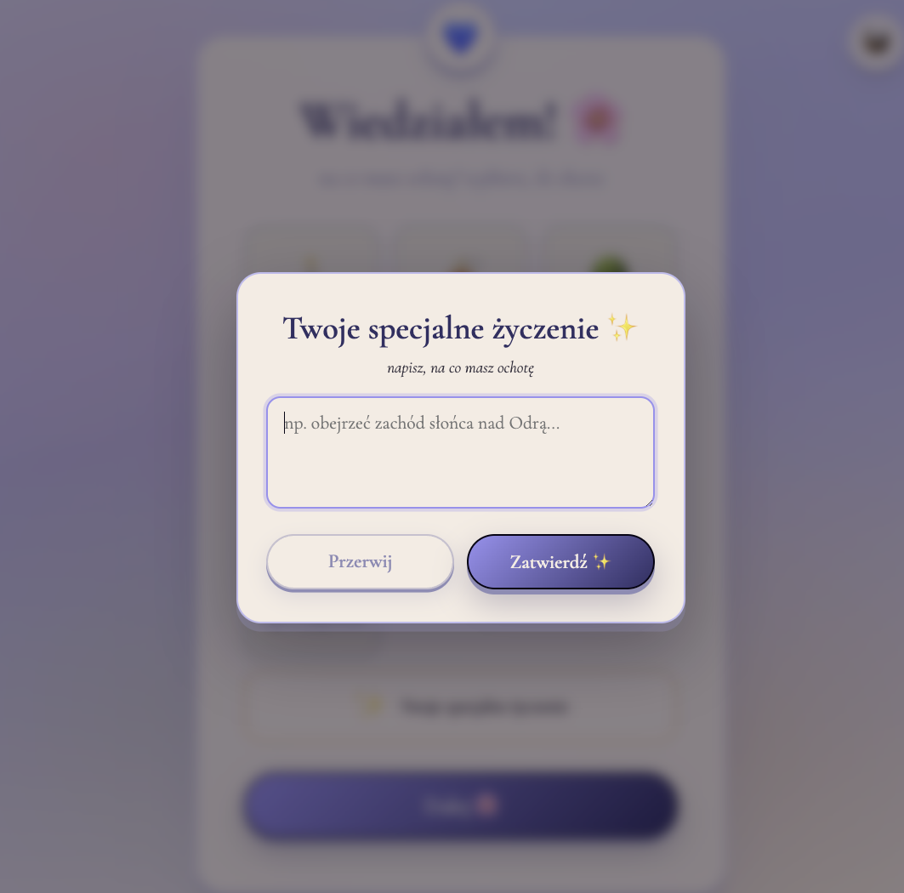
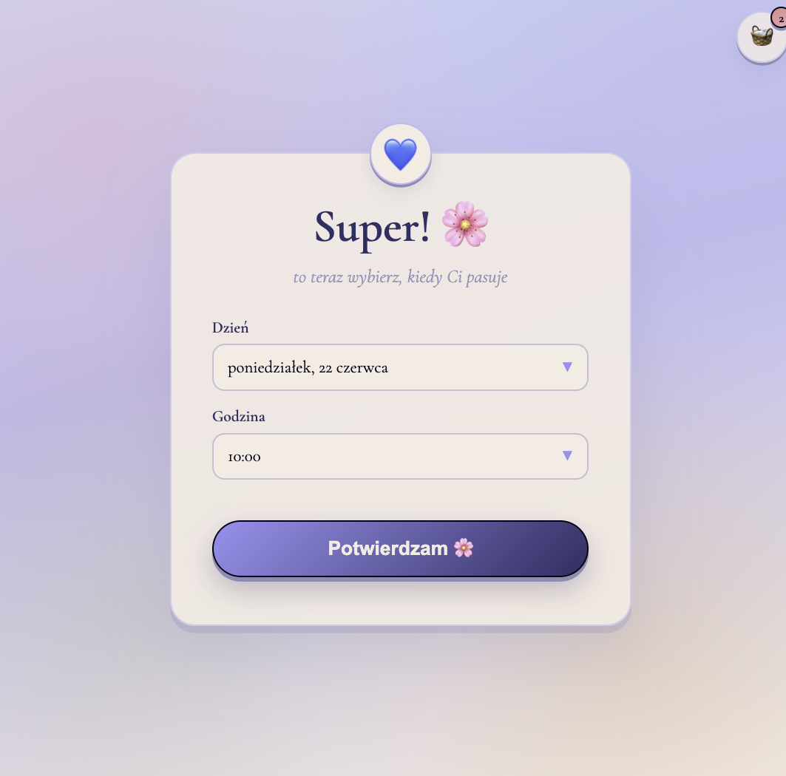
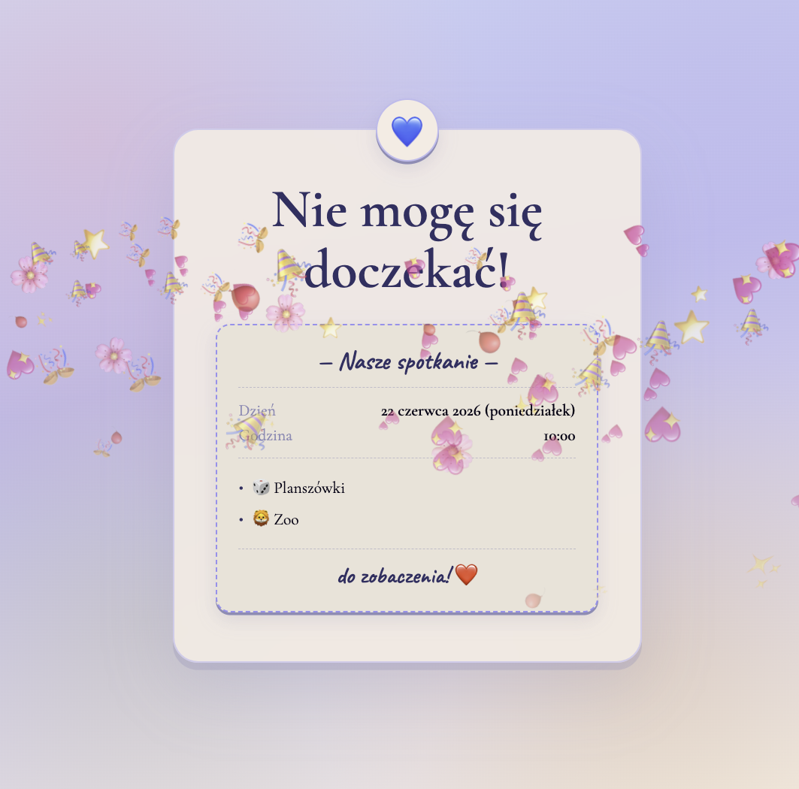

# Date Invite 💌

Interaktywna, jednostronicowa strona-zaproszenie na randkę / spotkanie. Zamiast suchego „kiedy masz czas?” - animowane intro, zabawny przycisk „Nie”, wybor aktywności z koszykiem i „paragon” podsumowujący plan.

---

## Zrzuty ekranu

### Intro (animacja Lottie)



Pełnoekranowa animacja `hand.json`: kliknij przycisk → animacja kliku → wejście na stronę. Palec reaguje na ruch myszy (hover).

### Główny flow











### Podziękowanie



---

## Co robi ta strona?

1. **Intro** - animacja Lottie na pełny ekran; użytkownik musi kliknąć, żeby wejść dalej.
2. **Pytanie** - „Kiedy kolejne spotkanie?” z przyciskami Tak / Nie (przycisk „Nie” ucieka i pojawiają się emoji).
3. **Aktywności** - wielokrotny wybor kafelków (spacer, jedzonko, piknik, planszówki, zoo, sport, ogród japoński) + opcjonalne **specjalne życzenie**.
4. **Koszyk** - licznik wybranych pozycji; emoji „wlatuje” do koszyka w rogu.
5. **Termin** - customowe dropdowny: dzień (od dziś do końca miesiąca) i godzina (10:00–22:00).
6. **Potwierdzenie** - paragon z podsumowaniem + opcjonalna wysyłka na Formspree + deszcz konfetti 🎉

Bez backendu - działa jako statyczna strona (GitHub Pages, Netlify, dowolny hosting plików). Layout jest responsywny i działa też na telefonie.

---

## Design

UI w palecie **„party keyboard”** (pastelowy błękit, lawenda, krem, fiolet, akcenty konfetti). Fonty: Cormorant Garamond + Caveat (Google Fonts).

---

## Uruchomienie lokalnie

```bash
cd date-invite
python3 -m http.server 8000
```

Otwórz [http://localhost:8000](http://localhost:8000).  
**Nie otwieraj `index.html` przez `file://`** - animacja Lottie i `hand.json` wymagają serwera.

---

## Konfiguracja

W `index.html` na początku skryptu:

```javascript
const FORMSPREE_ENDPOINT = "";  // URL formularza Formspree
const TWOJE_IMIE = "Wiktor";    // Twoje imię w powiadomieniu mailowym
```

Aktywności edytujesz w tablicy `ACTIVITIES` w tym samym pliku.

---

## Struktura projektu

```
date-invite/
├── index.html
├── hand.json
├── wroclaw.jpg
├── README.md
└── docs/media/screenshots/
```

---

## Technologie

- Czysty HTML / CSS / JavaScript (bez frameworka)
- [lottie-player](https://github.com/LottieFiles/lottie-player) (CDN) - intro
- [Formspree](https://formspree.io/) - opcjonalne powiadomienie e-mail
- Responsywny layout (mobile-first, `dvh`, safe area)

---

## Licencja

Projekt osobisty - użyj i zmieniaj według uznania. Animacja `hand.json` - sprawdź prawa użytkowania, jeśli pochodzi z zewnętrznego źródła.
